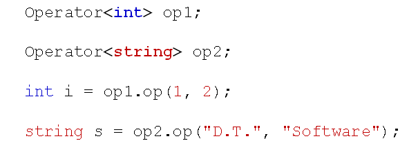

# 类模板的概念和意义
## 类模板
- 一些类主要用于存储和组织数据元素
- 类中数据组织的方式和数据元素的具体类型无关
- 如：数组类、链表类、Stack类、Queue类等
  C++中将模板的思想应用于类,使得类的实现不关注数据元素的具体类型,而只关注类所需要实现的功能。
- C++中的类模板
  - 以相同的方式处理不同的类型
  - 在类声明前使用template进行表示
  - <typename T>用于说明类中使用的泛指类型 T
  
  

- 类模板的应用
  - 只能显示指定具体类型，无法自动推导
  - 使用具体类型<Type>定义对象
  
  

- 声明的泛指类型 T可以出现在类模板的任意地方
- 编译器对类模板的处理方式和函数模板相同
  - 从类模板通过具体类型产生不同的类
  - 在声明的地方对类模板代码本身进行编译
  - 在使用的地方对参数替换后的代码进行编译
- 类模板的工程应用
  - 类模板必须在头文件中定义
  - 类模板不能分开实现在不同的文件中
  - 类模板外部定义的成员函数需要加上模板<>声明
  
## 小结
- 泛型编程的思想可以应用于类
- 类模板以相同的方式处理不同类型的数据
- 类模板非常适用于编写数据结构相关的代码
- 类模板在使用时只能显示指定类型