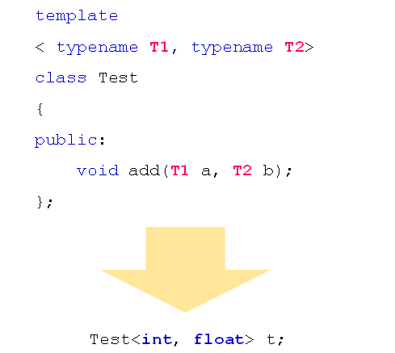
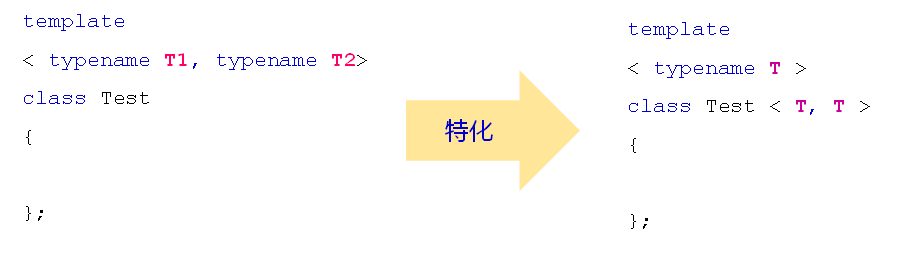
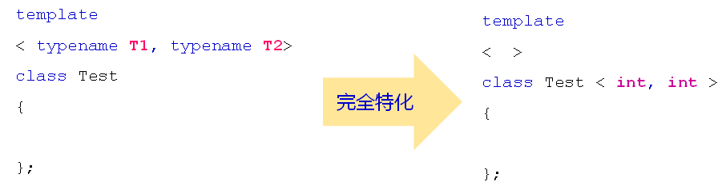
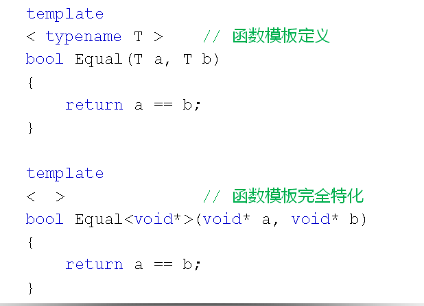

# 类模板深度剖析
## 多参数类模板
- 类模板可以定义任意多个不同的类型参数
  
  

- 类模板可以被特化
  - 指定类模板的特定实现
  - 部分类型参数必须显示指定
  - 根据类型参数分开实现类模板
  
  

- 类模板的特化类型
  - 部分特化 - 用特定规则约束类型参数
  - 完全特化 - 完全显示指定类型参数
  
  

- 类模板特化注意事项
  - 特化只是模板的分开实现
    - 本质上是同一个类模板
  - 特化类模板的使用方式是统一的
    - 必须显示指定每一个类型参数
  
## 特化的深度分析
- 重定义和特化的不同
  - 重定义
    - 一个类模板和一个新类(或者两个类模板)
    - 使用的时候需要考虑如何选择的问题
- 特化
    - 以统一的方式使用类模板和特化类
    - 编译器自动优先选择特化类
- 函数模板只支持类型参数完全特化
  
  

## 工程中的建议
当需要重载函数模板时，优先考虑使用模板特化
当模板特化无法满足要求，再使用函数重载

## 小结
- 类模板可以定义任意多个不同的类型参数
- 类模板可以被部分特化和完全特化
- 特化的本质是模板的分开实现
- 函数模板只支持完全特化
- 工程中使用模板特化代替类(函数)重定义