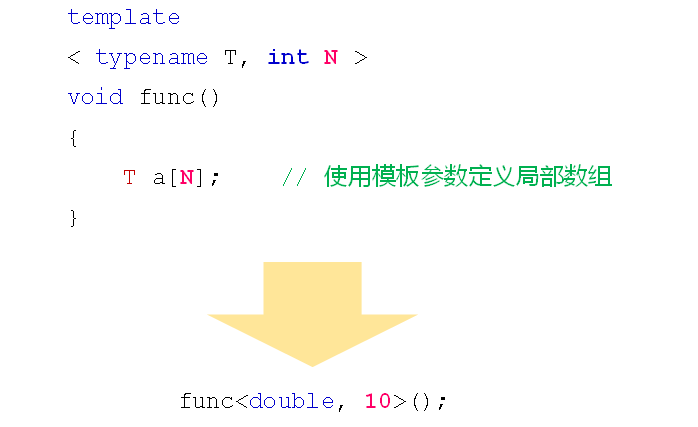

# 数组类模板
## 预备知识
- 模板参数可以是数值型参数(非类型参数)
  
  

- 数值型模板参数的限制
  - 变量不能作为模板参数
  - 浮点数不能作为模板参数
  - 类对象不能作为模板参数
  - ...
  
  本质：
  模板参数是在编译阶段被处理的单元，因此，在编译阶段必须准确无误的唯一确定

## 有趣的面试题
用你觉得最高效的方法求1+2+3+…+N的值!

## 小结
- 模板参数可以是数值型参数
- 数值型模板参数必须在编译期间唯一确定
- 数组类模板是基于数值型模板参数实现的
- 数组类模板是简易的线性表数据结构