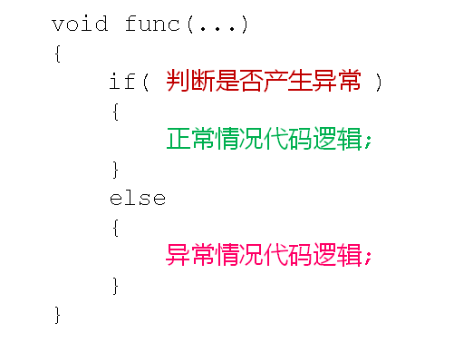

# C语言异常处理
## 异常处理
- 异常的概念
  - 程序在运行过程中可能产生异常
  - 异常(Exception)与Bug的区别
    - 异常是程序运行时可预料的执行分支
    - Bug是程序中的错误，是不被预期的运行方式
- 异常(Exception)和Bug的对比：
  - 异常
    - 运行时产生除0的情况
    - 需要打开的外部文件不存在
    - 数组访问时越界
  - Bug
    - 使用野指针
    - 堆数组使用结束后未释放
    - 选择排序无法处理长度为0的数组
- C语言经典处理方式:
  
  

- 缺陷
  - divide函数有3个参数，难以理解其用法
  - divide函数调用后必须判断valid代表的结果
    - 当valid为true时，运算结果正常
    - 当valid为false时，运算结果出现异常
- 通过setjmp()和longjmp()进行优化
  - int setjmp(jmp_buf env)
    - 将当前上下文保存在jmp_buf结构体中
  - void longjmp(jmp_buf env, int val)
    - 从jmp_buf结构体中回复setjmp()保存的上下文
    - 最终从setjmp函数调用蒂娜返回，返回值为val
- 缺陷
  - setjmp0和longjmp()的引入
    - 必然涉及到使用全局变量
    - 暴力跳转导致代码可读性降低
    - 本质还是if…else…异常处理方式
  

## 小结
- 程序中不可避免的会发生异常
- 异常在开发阶段就可以预见的运行时问题
- C语言中通过经典的if...else...方式处理异常
- C++中存在更好的异常处理方式
