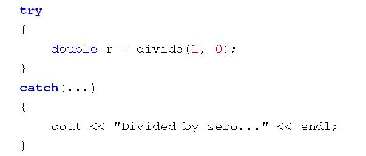
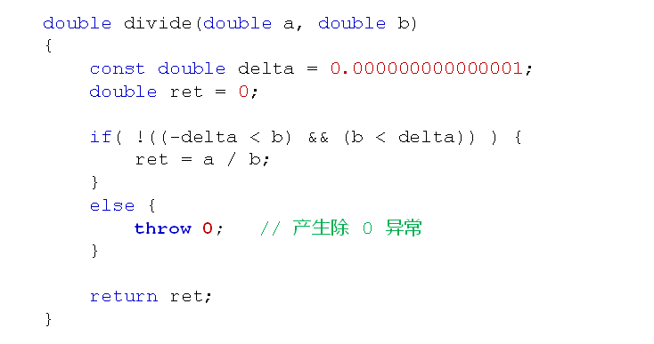
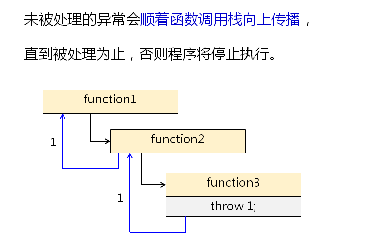
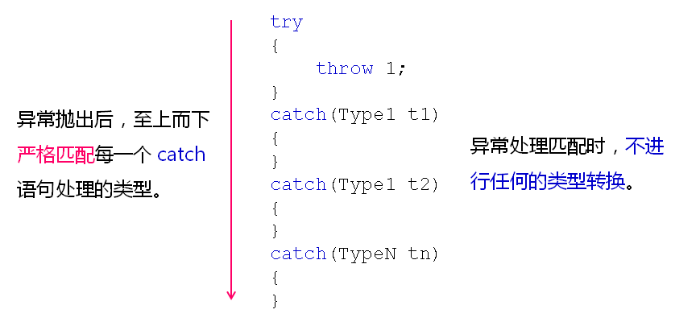

# C++中的异常处理(上)
## C++异常处理
- C++内置了一场处理的语法元素try...catch...
  - try语句处理正常代码逻辑
  - catch语句处理异常情况
  - try语句中的异常由对应的catch语句处理
    
    

- C++通过throw语句抛出异常信息
  
  

- C++异常处理分析
  - throw抛出的异常必须被catch处理
    - 当前函数能够处理异常，程序继续往下执行
    - 当前函数无法处理异常，则函数停止执行，并返回
   
   

- 同一个try语句可以跟上多个catch语句
  - catch语句可以定义具体处理的异常类型
  - 不同类型的异常由不同的catch语句负责处理
  - try语句中可以抛出任何类型的异常
  - catch(...)用于处理所有类型的异常
  - 任何异常都只能被捕获(catch)一次
- 异常处理匹配规则

## 小结
- C++中直接支持异常处理的概念
- try...catch...是C++中异常处理的专用语句
- try语句处理正常代码逻辑，catch语句处理异常情况
- 同一个try语句可以跟上多个catch语句
- 异常处理必须严格匹配，不进行任何的类型转换