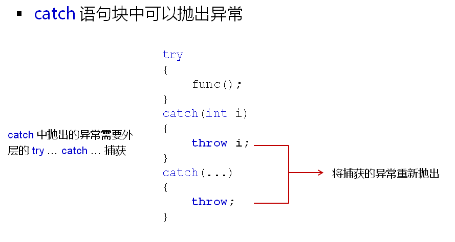
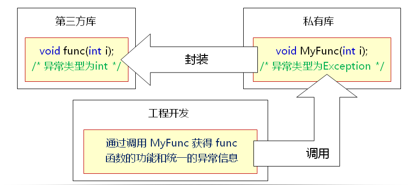
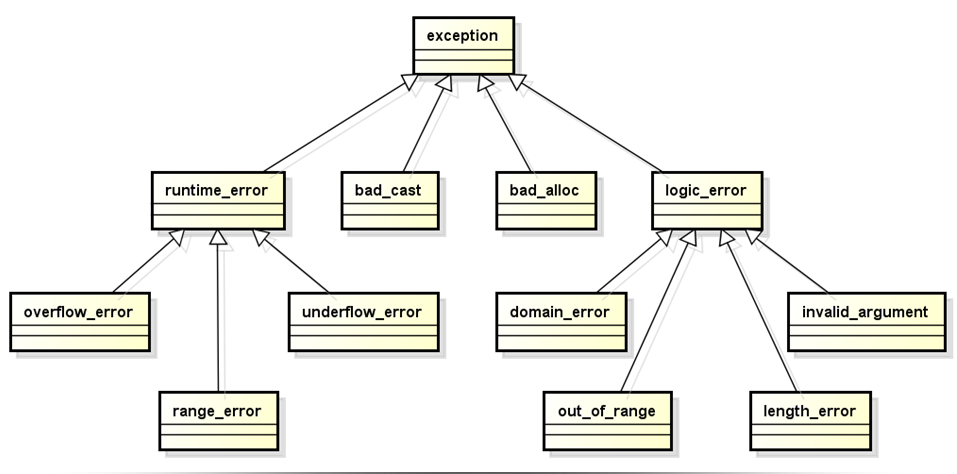

# C++中的异常处理(下)
## C++中的异常处理

- catch中捕获的异常可以被重新解释后抛出
- 工程开发中使用这样的方式统一异常类型
  
  

- 异常的类型可以是自定义类类型
- 对于类类型的异常的匹配依旧是至上而下严格匹配
- 赋值兼容性原则在异常匹配中依然适用
- 一般而言
  - 匹配子类异常的catch放在上部
  - 匹配父类异常的catch放在下部
- 在工程中会定义一系列的异常类
- 每个类代表工程中可能出现的一种异常类型
- 代码复用时可能需要重解释不同的异常类
- 在定义catch语句块时推荐使用引用作为参数
- C++标准库中提供了实用异常类族
- 标准库中的异常都是从exception类派生的
- exception类有两个主要的分支
  - logic_error
    - 常用于程序中的可避免逻辑错误
  - runtime_error
    - 常用于程序中无法避免的恶性错误
- 标准库中的异常
  
  

## 小结
- catch语句块中可以抛出异常
- 异常的类型可以是自定义类类型
- 赋值兼容性原则在异常匹配中依然适用
- 标准库中的异常都是从exception类派生的